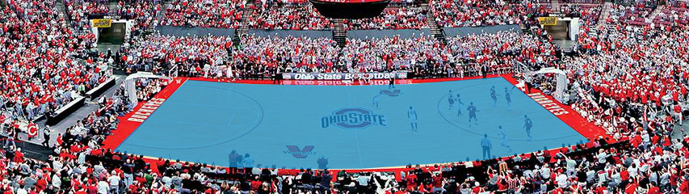

# Amateur Basketball Broadcasting Camera System

# Introduction

I am a coach and parent of two kids in an amateur basketball club here in Spain. I suggested the club to use some kind of AI powered camera to broadcast the games to Youtube instead of a volunteered parent with his mobile, but I have found existing commercial solutions are way too expensive for the economic reality of an amateur club: either the camera costs too much (3K to 5K€) and/or the yearly payment is too high (3K to 20K€ per year).

I have also investigated the possibility to use some kind of open source solution with some work done by myself without finding any alternative.

# The goal

The goal is to develop a “media gateway” device able to receive a panoramic video from a Commercial Off The Shelve (COTS) panoramic camera in RTSP/RTMP format and produce “professional-like” broadcast video to Youtube (RTMP). To do so, the system will be able to crop the original panoramic video in a way that “follows the action” and simulates the panning movement. This production needs to be fully automatic, with no human intervention beyond activating / deactivating the stream and initial calibration.

As an amateurish system the final video produced might have some glitches and especially miss some characteristics of professional-grade human production like zooming, replays and multiple angle of view, but should provide a fair enough experience, way beyond a static panoramic camera.

It will also lack features present in the commercial sports analytics solutions I have been able to find like automatic player statistics or highlights extraction, but these come at a multiple cost: the solution is expensive, the solution needs expensive hardware and the solution needs very complex algorithms to work, and thus time to develop them.

The three of them go against our secondary main goal, be able to produce the video solution at the lower cost possible, orders of magnitude smaller than current alternatives, using COTS hardware.

# The camera

The initial idea of the project was to develop our own custom camera, but after some initial iterations, this idea has been discarded due to two factors: increased complexity, as we need to include more elements into the final outcome as well as work on the dewarping / stitching stuff needed to produce a high quality panoramic view, and also because in order to enter production, a big Minimum Order Quantity (MOQ) would be requested, beyond the financial capabilities of this project. For sure, it might produce a cheaper end product, but this might not even hold true if we find the way to be able to use a single multimedia gateway device with multiple cameras.

Thus, we have seeked for viable COTS cameras with an horizontal FOV of 180º that are able to produce a single stream of already dewarped and stitched video. We have found several such alternatives, but we are going to focus on the cheapest one, as the price difference is significant.


1. Dual 4K sensor
2. 180º HFOV
3. RTSP output (doesn’t support RTMP)
4. Audio

The produced video stream has a panoramic 2x4K proportion, being 7.680x2.160 pixels. It could be configured to capture in 2xFullHD if needed due to the capacity of the gateway to work with such a big image.

Only one camera will cover a particular field. If more cameras are to be used it is because we might be interested in covering other fields, not to improve the coverage of the same one.

The fact to use a panoramic camera with multiple sensors is that it easily enables the sensation of virtual panning, once final video is produced at standard 4K size. Thus, this enables the “sensation” of the camera moving to follow the action that is what the viewers expect.

It is true a similar effect could be produced using a single lens 4K sensor, being far enough from the field to be able to cover the whole of it without too much HFOV so it doesn’t induce optical distortion (or it is corrected by the camera itself), and at the same time, being able to cover the full playground area in the vertical axis with a portion of the image. The key is, to cover the vertical playground with a portion of the whole image, allowing to produce the virtual PAN effect by cropping. The higher the ratio, the more PANNING we can get.

The same could apply for other panoramic cameras with 3 or 4 sensors, but I believe they don’t compensate for the extra cost.

# The field

The idea of the project is to be installed in small covered basketball facilities present in most cities. This applies to high school installations in the USA too, but for sure, is not targeted to stadium like facilities. This means:

1. Inside facilities with proper lighting and no rain or wind
2. Small distance from the sidelines to the wall to place the camera, maybe 6 to 10 meters at most
3. Multi sports facilities, thus a mess of lines in the playground
4. Public in just one side of the facility (the one with the camera) in most cases
5. Sport benches in the opposite side of the camera, thus in the view area of it

It might be possible to calibrate the camera environment when doing the installation to improve the broadcasting or simplify the computer vision requirements.

We define the following areas that might be used afterwards and that would be configured during camera installation by a professional.

1. **Playground.-** Ground level area covering the 4 corners of the basketball field. Only players, ball and referees are allowed to be inside this area, thus would be a great candidate for motion detection as would be independent from public movement or coach / player in the bench moving. Unfortunately, the ball and part of the player's silhouette can be outside this area as they can be above the ground level.\



2. **Area of interest.-** Is the 3D extension of the previous area, to 4m high in case of adult basketball or around 3.5m in the case of children basketball (minibasket). The ball could be anywhere inside this area, but at the same time, it might mean we include part of the public or benches as part of the capture


3. **Camera pose.-** From the original capture, the area of the background that will be covered by the camera by virtually panning it left and right. The “camera” will not go beyond the lefmost and rightmost extreme corners of the playfield. While maintaining the 32:9 proportion we have to warrant the area of interest is fully included in the view. If this is not the case, then the camera will have to go further to the left and right until all of it is covered or we can work at a reduced ratio, like 24:9 as long as we are between the 32:9 maximum and the 16:9 minimum. If that case, the PAN effect will be reduced.


It is important to warrant public doesn’t enter the playground area under any circumstance, for example if they stand up while watching the game. This should be possible as they are far away from the playground, but if the camera is not properly placed it might happen. This could interfere with the proposed motion detection stage.

The same applies to coaches and bench players. As they are closer to the playfield this could easily happen. This is why it is important to place the camera in the opposite side of the ground.

Finally, referees' silhouettes might also enter that area, but as they participate of the sense of “game motion” it doesn’t affect our concept.

```
As seen on the example captured imagez, some optical distorsion might be still present after the  
camera does the dewarping. This is only relevant if it affects the pose area. I don't have a real  
camera yet to test this scenario. Lets consider this doesn't happen, and if a later stage it is  
discovered otherwise, we might require a further optical correction stage. As this is not relevant  
to the "algorithm" stages, we can assume for now it is not relevant.
```

# The hardware

The initial project considered the possibility of developing a custom camera with 2 sensors, but MOQ requirements and the difficulty to do it as an open source project have suggested other paths. Thus we need some COTS that has the following capabilities:

1. Hardware assisted video decoding and encoding
2. Some capability to do neural networks with hardware assistance

After extensive searching, only 3 alternatives are left:

1. Nvidia Jetson Nano
2. Intel Movidius Myriad X
3. Nvidia Xavier NX

For the shake of this project, Wifi, Bluetooth or GPS are not relevant. We found some ARM based alternatives like Rockchip3399Pro but their Linux support is quite worrisome.

OpenVINO documentation is quite abundant and prolific, this is why we have started to play with it. Jetson Nano is more or less on the same pricing range, but has fewer TFLOPS (0.5) than Myriad X (1). Unfortunately, Xavier is quite more expensive (more than triple) so we will try to focus only on the first two.

The SBC we have found has an Intel Movidius Myriad X as VPU with PCI signaling (not USB) and a small Intel Atom x5-E3940 SOC as CPU. It is fully compatible with OpenVINO and in the future, could allow us to grow to other mini computers with multiple Movidius Myriad X VPUs available.


Actually, we believe the algorithmic idea would be simple enough to consider the scenario of using just one gateway device to support multiple cameras concurrently, producing one Youtube stream for each.

For now, lets consider we already have the hardware running and doing the conversion from RTSP to RTMP either with gstreamer or ffmpeg. What are pending are the algorithmic and video production modules in such a chain, being both compatible with OpenVINO with Intel Movidius Myriad X target.

# The motion detection / tracking module

First of all, we need to understand the concept of “following the action” in a basketball game. In essence, means being able to have the ball and as many players as possible in the broadcasted frame, following the rule of the 1/3<sup>rd</sup> (the ball should be on the 1/3<sup>rd</sup> position of the frame as much as possible). 

Now, professional broadcasting involves much more, zooming into special actions, replays of highlights, etc. They are great, but beyond the capacity and intentions of amateur broadcasting.

The same applies to advanced sport analytics. They are able to automatically extract player actions, like missed shots, passes and so on, but again, they are beyond the goal of an amateur team.

So our intrinsic goal is to be able to virtually pan a camera to follow the action by cropping a panoramic view, and try to include the ball most of the times (but maybe not exactly all), and try to keep as many players in the view in the process as possible.

Basketball is not an easy environment to achieve this. Players moving in erratic trajectories, players covering each other from the FOV of the camera, ball easily occluded in multiple occasions by one or multiple players, fast movement of the ball, etc.

Most of the papers we have read on the topic, focus on the capability to track the ball alone, or the ball plus the players, and devote quite a lot of effort in trying to not lose the track of either the ball or especially the players (id switch).

Instead two such papers have given us the clue of how to tackle the issue of knowing where to point the camera:

1. [Automatic camera selection in the context of basketball game](https://hal.archives-ouvertes.fr/hal-01835033/file/automatic-camera-selection.pdf), Florent Lefevre, Vincent Bombardier, Patrick Charpentier, Nicolas Krommenacker and Bertrand Petat
2. [As Seen on TV: Automatic Basketball Video Production using Gaussian-based Actionness and Game States Recognition](https://openaccess.thecvf.com/content_CVPRW_2020/papers/w53/Quiroga_As_Seen_on_TV_Automatic_Basketball_Video_Production_Using_Gaussian-Based_CVPRW_2020_paper.pdf), Julian Quiroga, Henry Carrillo, Edisson Maldonado, John Ruiz and Luis M. Zapata

They share one common concept: it is important to know where are the players located in the field in a very approximate way, without distinguishing between them. The second also tracks the ball. 

We believe the first paper makes the mistake of not following the ball “at all” that could lead to potential camera errors (fast breaks and slow transition from out of bounds tend to have the ball quite far away from the “mass center”), but is simpler to compute.

The second computes a more complex knowledge of where players are, and specially adds a safenet to always have the ball in view. Also, trains a neural network to try to understand the state of the game based on players distribution in a 2D representation of the game, that we believe a similar effect could be achieved by just 1D projection of the movement in a similar way as does the first, and replace the neural network with some basic rules (that could be later replaced by such a neural network).

Ourproposal will mimic the proposal of [2] but using simplifications found in [1] :

1. Use basic motion detection instead of complex player tracking
2. Project into 1D and smooth the curve as in [2] but without the need for the complex formulation nor the projection in the 2D space (for example, just smooth the number of pixels that have moved in the vertical axis into the horizontal dimension)
3. Focus on the peak of such function but keep an eye on the ball as in [2] 

## Players distribution

As proposed in [1], at t we will perform a basic pixel subtraction of grayscale frames with frame t-4 in the playground area. 

Potentially, this could mean part of the body of a player or even the ball is not included in this particular operation but it will warrant we won’t see any kind of movement from coaches (as they are not allowed to enter the playground area), public (the camera placement should warrant this), etc. It is important this operation is resistant to changing lightning conditions or reflexes, but as the camera itself is still, this should not be an issue. Yes, fully static players won’t be detected, but in the game of basketball it is really strange for this to happen, and if it does, it will probably be of low interest for the game.

Slower alternatives like Gaussian Mixture-based Background/Foreground Segmentation or such could be considered if  the basic subtracting would be too prone to noise. It is extremely important any movement detected in this way is related to players or ball movement, not shadows or changes in lighting conditions.

Now, in opposition to [1] that just focuses on computing the “center of gravity” but as a simplified version of [2] we will stick to the 1D projection the second paper does, but just using the number of pixels with movement in the y dimension projected into the x axis. 

```
The output of this module will be:
1. Report upwards the leftmost extreme
2. Report upwards the rightmost extreme
3. Report upwards the maximum point
4. If a dual peak scenario is found, report it upwards (see later)
```


## Ball detection

Most of the literature focuses on algorithms that try very hard to re identify a target lost due to occlusion, with very much attention to not having identity switches. Also, they try to get the fitting box to perfectly cover the ground truth when in reality, just a general idea of ball location is needed. We believe such efforts are too much waste of computing resources for the needs of this project. To finalize, most of the papers make claims about realtime performance using state of the art GPUs, but not with something as restricted as a Jetson Nano or an Intel Movidius X.

The main difficulty here is the size of the video frame (7.680x2.160), the high frame rate (30fps) and the need to do it in real time. If impossible to meet this goal, we could consider the alternative of using a 2xFullHD (3.840x1080)  at 30fps as source but those are the minimums as final video production needs to be Full HD @ 30fps at least.

We understand detecting a free flying ball will be an easy task in general due to the fact there are no similar objects in the frame, the ball is a sphere (circle) and has a distinguishing color pattern. What would be harder will be to detect the ball when partially or fully occluded, that will happen quite a lot. Still, just a glimpse of the ball location will be enough, without worrying too much about precision. 

Also, a static ball is of less interest to the video production (if you just recall its last position instead), so it might be worth to add the additional filtering of being “in movement” that in combination of the priorly computed movement mask could reduce the burden.

As for candidate algorithms our clues to use we have found that could be ported to Intel Movidius X VPU through OpenVINO are:

**Object detection**

1. [https://github.com/dog-qiuqiu/Yolo-Fastest](https://github.com/dog-qiuqiu/Yolo-Fastest)
2. [https://github.com/SyGoing/LFFD-OpenVINO](https://github.com/SyGoing/LFFD-OpenVINO) (the author states the model can be adapted to other single type object classes, like would be the case with the basketball)
3. [SkyNet](https://arxiv.org/pdf/1909.09709.pdf)
4. [ThunderNet](https://openaccess.thecvf.com/content_ICCV_2019/papers/Qin_ThunderNet_Towards_Real-Time_Generic_Object_Detection_on_Mobile_Devices_ICCV_2019_paper.pdf) (code available?)

**Object tracking**

1. [SiamRPN](https://github.com/STVIR/pysot) (faster than SiamMask and SiamRPN++ at the cost of less precision)
2. [SPSTracker](https://github.com/TrackerLB/SPSTracker)
3. [Kalman Filter Ensemble-Based Tracker](https://github.com/psenna/KF-EBT)
4. [DaSiamRPN](https://github.com/foolwood/DaSiamRPN) (on par with SiamRPN’s performance but more precise)
5. [Ensemble of Kernelized Correlation Filter Tracker](https://github.com/uzkent/EnKCF_Tracker)

The output then will be the position of the ball. If by any means the ball cannot be detected due to occlusion, then the prior known position will be reported, but maybe we will need to also flag this situation.

```
Combining the outputs from the two components we will have:
1. Leftmost movement
2. Rightmost movement
3. Maximum movement
4. Time out state
5. Ball position (previus if unknown)
6. If ball position is firm or suspected
7. Warm up state
```

As for warmup state, see below.

# The production module

Once we have an idea of where the players and the ball are, we have to decide where to place the camera view in order to try to maintain the ball in sight all the time as well as many players as we can. 

We have to try to follow the 1/3<sup>rd</sup> rule used in professional sports broadcasting, or at least something similar. We are going to define the hot area between 1/5<sup>th</sup> and 4/5<sup>th</sup> of the available frame. The area between the two will be the HOT area of the view, and our goal is to always keep the ball in that area and as many players as possible.


The camera is giving us a 32:9 image ratio. As we will take away the left and right extremes to get into the camera pose, we should still maintain such a ratio and view all the area of interest. We are going to suppose this is the case, but the system could be used as long as the ratio is between the 32:9 and the final 16:9.

Let's say for now we stay with that 32:9 ratio. In that case, we will have the capability of panning the camera view “twice” from the left side to the right side of the camera pose.

We also have to understand our design is going to be quite specific to basketball. Unfortunately they might not apply to other sports. What is important is, the production rule mechanism used to control this system needs to be adjustable to other sports or desires given the case.

Actually, as in paper [2] we could envision a system that learns those rules based on mimicking the behavior of a professional cameraman, but to be honest, we believe that is going to complicate matters.


## Virtual panning

We define virtual panning as the movement effect produced by cropping the original 32:9 image into a 16:9 image in such a way that the resulting image seems to travel sideways.

Our automatic cameraman system will only consider panning, without any tilt nor zooming.


## Game states

As in [2] we are going to define several game states. In opposition to that paper we might consider additional states, will not use a neural network to decide which one we are, and will use the basic 1D projection to decide on the state. Of course, this element could be enhanced in the future with stuff like [2], but for now it is ok with this more basic concept.

1. Static play
2. Not playing
3. Out of bounds
4. Transition


## Static play

Funny enough, the situation where the algorithms fail the most due to weird movement patterns, heavy player and ball occlusion, identity switching, etc is the easiest one for the amateur cameraman. 


```
We consider a static play situation when the camera view is on the extreme side of  
the camera pose (left or right) and all movement is on the same side of the field
```


All the movement, represented by the triangles (leftmost, max, rightmost), and the ball, represented by the black circle are on the same side of the field, and the camera view is already in the leftmost position.

In this situation the cameraman has nothing to do and should stay stationary as long as it is feasible. This could be used to “relax” the ball tracking needs to 1 every X frames instead of every frame. The same could apply for movement detection, it could be applied every Y frames instead of in every one.

The condition that breaks the “static play” state is the detection of movement in the opposite side of the field. This is why it is so important to warrant no noise signal is produced in the playground area in the context of motion detection.

Unfortunately, other sports don’t follow this pattern. In volleyball players are on different sides of the field all the time. In soccer and handball, while there is a tendency to move most players to the opposite side, at least the goalkeeper will stay, and in the case of soccer some defensive players.


## Not playing (time outs, halftime)

These states will be evident but won’t be immediate. As their detection doesn’t need to be fast, we could run the logic to detect them every few seconds instead of in real time.

**Timeouts**

The movement distribution will adopt a “dual bell” shape and stay more or less stationary.


**Halftime (warmup)**

While this situation could be confused with a timeout (actually it will start and end in a very similar shape), the main thing to distinguish it will be the presence of multiple basketballs in the court.


Both situations will be detected by the prior module as they are in charge of managing the movement function and the ball detection. As said, it is not relevant to detect them in every frame, once every Z seconds will be ok.

In either case, the production module will transition zoom out at a _Zoom speed_ into a full court view. Also, in the future, it could be used to broadcast pre recorded videos (sponsors, commercials, …)

The other way around, once the situation is no longer detected as timeout or warmup, it will slowly zoom in into the standard view to the ball at _Zoom speed_

## Out of bounds

When the ball goes beyond the area of interest during play it will be considered out of bounds. In general, this should not be an issue, as the camera will be already pointing to the area the ball was last seen while still inbounds.

But it might happen when moving from the “not playing” state, were the camera doesn’t know very well where to point at, and at the same time, cannot see the ball.

If the ball is inbounded in the middle of the court or in the baseline opposite to the attacking side, the transition rules will apply (see later) and if not seeing the ball, will point in such a way the extreme players (those around the midfield or the baseline) are not left out.

If the ball is inbounded in the baseline or sidelines of the attacking side, players will adopt a distribution similar to the static play scenario that will be applied as a final camera view


## Transition

This is by far the most complex state as it requires making decisions on where to place the ball in the view (or at least the last known position of it) and how to put as many relevant players as possible within the view.

Remember all the camera movement will be in the horizontal axis as a panning effect, with no tilt nor zoom.

The general idea is as in [1] and [2] : try to follow the general movement of the players, but as in [2], keep an eye on the ball just in case it gets out of camera view.

The rules would be:

1. **Center the view in the max movement point but warrant the ball is in the hot area**

As long as the ball is within the ball area, the camera will follow the max movement point to keep it centered in the image. The displacement needs to be below _V<sub>safe</sub>_ speed.


2. **If the ball gets out of the hot area, recover it**

If by the movement of the camera due to following the max movement point, the ball gets out of the hot area, adjust framing to place it in the 1/5th or the 4/5th line (the closest). The displacement needs to be below _V<sub>unsafe</sub>_ speed.


As you can see in the diagram, the “centered” framing (slashed) left the ball outside the hot area. In this case we have to readjust the framing to leave the ball in the 1/5th line. Now, as a more dangerous situation, a higher speed of camera movement would be allowed, and this would be relevant for example when following a fast pass in a fast break, in order to try to keep pace with the ball.

Also, in some cases, the ball could end up being fully out of the frame. In this case the camera would be allowed to move at _V<sub>critic</sub>_ speed to get it back into the viewing area. Of course the user will perceive such a violent move, but this is preferable to lose the ball. This in general might happen when losing the sight of the ball for a long time.

3. **Ball and last movement out of the hot area when not seeing the ball**

As a general rule, when not seeing the ball we will consider it static in the last known situation and apply the rest of rules.

But there would be a special situation, that could potentially happen quite a bit if the last man is the one dribbling the ball upwards and covering it once in a while.


So if both the suspected position of the ball and the extreme player are both to the outside of the 5th area, instead of trying to place the static ball in the 1/5th or 4/5th line, we will place the extreme player instead. The speed, as in the case of the ball will be _V<sub>unsafe</sub>_. 

The idea behind this concept is, if the ball is occluded, it will most probably be by the first / last player.

So these 3 rules give us the idea or where we want to point the camera view. Let's talk now about speeds and smoothness.

## Speed and smoothness

First of all the have the following speed definitions:

*   _V<sub>safe</sub>_ : the minimum between the horizontal speed of the max movement point and a configurable value
*   _V<sub>unsafe</sub>_ : the minimum between the horizontal speed of the ball and a configurable value
*   _V<sub>critic</sub>_ : a configurable value
*   _Zoom speed_ : a configurable value

So our first goal would be to not move the camera so fast it would be disturbing to the watcher.

The second goal would be to warrant the smooth movement of the camera, in such a way it is not erratic nor shaky. For sure other open source projects have implemented this already for PTZ systems.

```
So the final output will be:
1. A cropped frame in 16:9 proportion from the panoramic original as closest as possible to desired
2. Movement in such a way it doesn't violate the 3 velocities limits
3. Movement in such a way doesn't seem erratic or shaky
```

# Further steps

Once at this stage, the frame could be resized to the desired output quality. This is because most facilities won’t use 4K but Full HD or 720p. This is already doable using OpenVINO stack.

# What we are missing

1. Module for either FFMPEG or gstreamer for the movement detection and ball tracking. Can be two modules if desired.
2. Module to apply production rules based on produced information in prior module(s)
3. All software has to be accelerated using OpenVINO functions
4. In particular, all software should be possible to compile for Intel Movidius Myriad X VPU
5. Software should be able to work with a panoramic source at 2x4K@30fps and produce 1x4K@30fps. If not possible with the Intel Movidius Myriad X VPU or Jetson Nano, discuss it. It is mandatory to work at least with a panoramic source of 2xFullHD@30fps and produce a 1xFullHD@30fps

Our intention is to create a community to further improve this project: adapt it to other sports, improve algorithms, include the support for live scoreboards, include the capability to run pre recorded commercials during game pauses, etc.

Also, we hope this will be an ongoing project, and if in the first iteration we can support only one camera, try to further optimize it to support multiple cameras (in theory, one Intel Movidius is able to do so).
